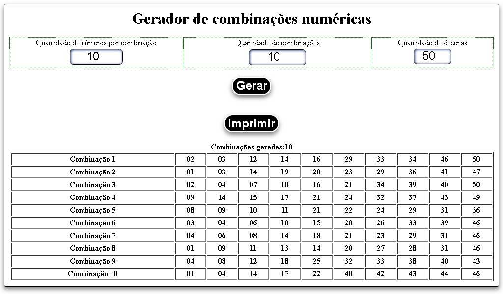
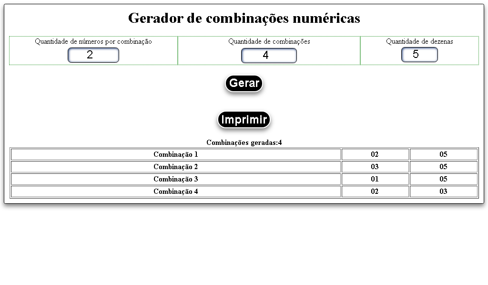

# Gerador de combinações numéricas desenvolvido com Vue js
Web App para gerar combinções numéricas que usa uma função de validação com a fórmula da combinação que é N!/S!*(N-S)! que impede da aplicação gerar dados errados ou repetidos,o N da fórmula é a quantidade de elementos que desejo combinar, no caso chamo de dezenas no terceiro input, e a expressão N! siginifica o valor de N fatoriado, exemplo N = 4, então N! = 4 * 3 * 2 *1, N! = 24, e por último o S que significa a quantidade de números que cada combinação tera.

A aplicação conta com três inputs e dois botões.

Primeiro input coleta quantidade de números por combinação.

Segundo input coleta quantidade de combinações que deseja gerar.

Terceiro input coleta quantidade de dezenas ou arranjo de números.

O botão de gerar como o próprio nome já diz gera as combinações.

O botão de imprimir exibi a página de impressão com a tabela já formatada para o usuário imprir sem que saia com os inputs, botões ou outro elemento do html.

Exemplo de entradas e saida do programa.

entradas: 2 3 3
saida:
  
1 2

1 3

2 3

[Executar Gerador de Combinações](http://alex5ander.github.io/geradordecombinacoes)
